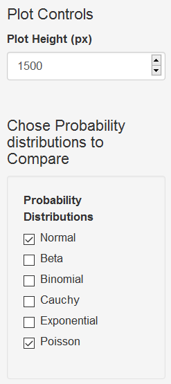
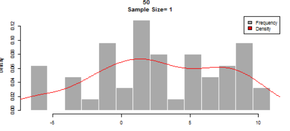

```{r setup, include=FALSE}
knitr::opts_chunk$set(echo = FALSE)
```

## Introduction

Central Limit Theorem is a finding in statistics knowledge area. A description of it
can be found in the following link:

- https://www.khanacademy.org/math/statistics-probability/sampling-distributions-library/sample-means/v/central-limit-theorem

The Central Limit Theorem Tester is intended to help visualize the effects of the
central limit theorem applied to some probability distributions.

## Graphical Interface: Sample Controls


- **Number of Samples**: Amount of final data samples used for the histogram creation.

- **Sample Size**: Each final data sample is the mean of a quantity of samples of the 
given probability distribution. Central Limit Theorem says that the more samples
are considered the closest to normal distribution. Sample size is the number of
probability distribution samples that are being considered.

**Example:**
 Number of Samples=3, 
 Sample Size=2:

    final Sample1 = mean(3, 3) = 3
    final Sample2 = mean(2, 2) = 2
    final Sample3 = mean(5, 1) = 3
    
```{r slide2, echo = FALSE}
hist(c(3,2,3))
```

## Other Plot Controls
 

**Plot Height**: Controls the output height. Set a higher value
when the plot is too small.

**Probabilty Distribution to Compare**: Put a check mark in the box besides the name of the
probability distribution to show in the plot area.


## Plot Description


Histogram of the final data samples(see slide#3).

- **Bars**: Show the frequency at which that value appears in the dataset.
 - **Line**: Shows the density of the data. Dencity shows where the values occure with a higher probability with respect to the analyzed dataset; higher the line higher the density.


