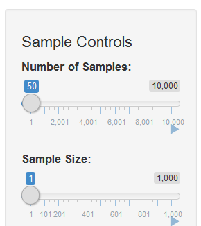

```{r setup, include=FALSE}
knitr::opts_chunk$set(echo = FALSE)
```

## Introduction

Central Limit Theorem is a finding in statistics knowledge area. A description of it
can be found in the following link:

- https://www.khanacademy.org/math/statistics-probability/sampling-distributions-library/sample-means/v/central-limit-theorem

The Central Limit Theorem Tester is intended to help visualize the effects of the
central limit theorem applied to some probability distributions.

- Source Code in GitHub: https://github.com/axelgafu/DataProductsW4
- Running application at Shiny web site: https://axelgafu.shinyapps.io/DataProductsProject/

## Graphical Interface: Sample Controls


- **Number of Samples**: Amount of final data samples used for the histogram creation.

- **Sample Size**: Each final data sample is the mean of a quantity of samples of the 
given probability distribution. Central Limit Theorem says that the more samples
are considered the closest to normal distribution. Sample size is the number of
probability distribution samples that are being considered.

**Example:**
 Number of Samples=3, 
 Sample Size=2:

    final Sample1 = mean(3, 3) = 3
    final Sample2 = mean(2, 2) = 2
    final Sample3 = mean(5, 1) = 3
    
```{r slide2, echo = TRUE}
hist(c(3,2,3))
```

## Other Plot Controls
 

**Plot Height**: Controls the output height. Set a higher value
when the plot is too small.

**Probabilty Distribution to Compare**: List of the available probability distributions in
the tool. The selected probability distributions will be shown in the the plot area.


## Plot Description


Histogram of the final data samples(see slide#3).

- **Bars**: Show the frequency at which that value appears in the dataset.
 - **Line**: Shows the density of the data. Dencity shows where the values occure with a higher probability with respect to the analyzed dataset; higher the line higher the density.

### What the Tool Does?
Lets assume "Normal" distribution is selected with Num_of_samples=50, Sample_Size=10, 
a mean=1 and standard deviation=5. The code to generate that chart is shown below:

```{r slide5, echo = TRUE}
Num_of_samples <- 50
Sample_Size    <- 10
MeanSet        <- 1
StDevSet       <- 5

# Generate Data (before sample means)
xnorm <- rnorm(Num_of_samples*Sample_Size, mean = MeanSet, sd=StDevSet)

# Generate final samples based on random samples (Central Limit Theorem)
#-------------------------------------------------------------------------------
xnorm <- rowMeans(matrix(xnorm, Num_of_samples, Sample_Size))

# Generate histogram of mean samples,
#-------------------------------------------------------------------------------
hist(xnorm, freq = FALSE, col = 'darkgray',
       border = 'white', 
       main   = "Normal Distribution",
       xlab   = "Mean=1; Standard Deviation=5")
  lines(density(xnorm), col="red")
  legend("topright", c("Frequency", "Density"), fill=c("darkgray", "red"))

```

The tool will automate the generation of that kind of charts in order to compare the
effect of the central limit theorem by teaking number of samples and sample size variables.
